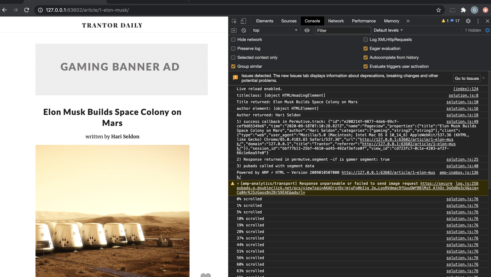
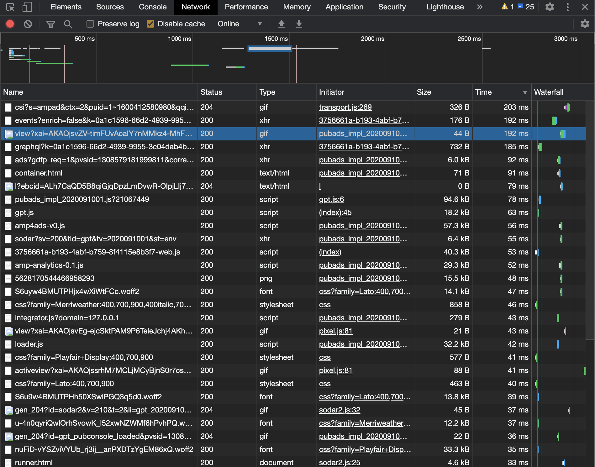

#Todo:
 [x] Permutive Script in HTML Header
  *Script will run = ready to track. Metadat persist in Client localStorage*
[] Set up tracking (View & Scroll)
  [x] Get Elems to pass to props.
  [x] Pass props that match Schema (strings/ array).
  *Tracking data, userID & custom properties POST to Permutive*
  []

  How would you go about investigating the issue?

  > There are several ways to diagnose potential problems.
  A simple console log can display the sequence of calls/responses and the payload as shown below:

  

  >Additionally, a waterfall view of network response times will show a trace of request made and duration for each call and response.
  Here we can drill down and validate expected behaviors are taking place. ie. Correct segment ID are captured, the right schema is passed to Permutive, etc.
  With a network trace we can try to reproduce the issue and see the time it takes for permutive to finish its tracking function, pass the data to segment and finally pass segment tags to the DFP ad server.`

  

  What factors could cause Permutive to load more slowly than DFP ads?

  >While Permutive loads asyncronously to optimize data processing, certain function calls may add to the response time. Data may have to be calculated, parsed and passed to permutive before a response is returned. Since segment data is checked against a profile that was configured in the Permutive Dashboard, that journey to POST/GET may be slower than fetching DFP ads.``

  Are there things the publisher may be able to change with their website/deployment, to improve the situation?
  > Ultimately the goal is to have the segment rendered and ready to pass into DFP before the default ad gets triggered, there is potential for the publisher to prioritize scripts by adding preload and prefetch tags. (https://developer.mozilla.org/en-US/docs/Web/HTML/Preloading_content).

  Are there things we may be able to change on our end, to make Permutive load faster?
  >Cache events...
